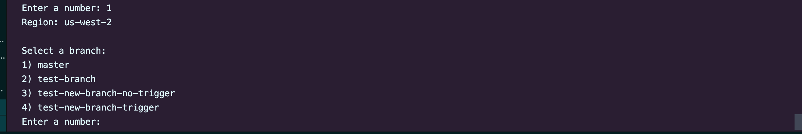

# Aurora Serverless Flyway DB

Aurora Serverless Flyway DB is a template project that is used to setup an [Amazon Aurora Serverless Database](https://aws.amazon.com/rds/aurora/serverless/) that is integrated with [Flyway](https://flywaydb.org/) to manage database migrations. This integration is accomplished through the use of an [AWS ECS Fargate](https://aws.amazon.com/fargate) task along with the help of [GitHub Actions](https://github.com/features/actions).

## Contents
- [Overview](#overview)
  - [AWS](#aws)
  - [Terraform](#terraform)
  - [Flyway](#flyway)
  - [GitHub Actions](#github-actions)
- [Getting Started](#getting-started)
  - [Repository Setup](#repository-setup)
  - [Secrets Manager Setup](#secrets-manager-setup)
    - [Adding New Database Users](#adding-new-database-users)
  - [Terraform Infrastructure Setup](#terraform-infrastructure-setup)
    - [Aurora-DB](#aurora-db)
    - [ECS-Cluster](#ecs-cluster)
    - [Fargate-IAM](#fargate-iam)
    - [Flyway-Fargate-Task](#flyway-fargate-task)
    - [Bastion](#bastion)
  - [GitHub Actions Config Setup](#github-actions-config-setup)
    - [Infrastructure Config Object](#infrastructure-config-object)
    - [Infrastructure Region Config Object](#infrastructure-region-config-object)
    - [Aurora DB Config Object](#aurora-db-config-object)
    - [Flyway Task Config Object](#flyway-task-config-object)
    - [Bastion Config Object](#bastion-config-object)
  - [Deploy Infrastructure](#deploy-infrastructure)
    - [Destroy Infrastructure](#destroy-infrastructure)
  - [Build Flyway Docker Image](#build-flyway-docker-image)
  - [Run Flyway Migration](#run-flyway-migration)
  - [Generate Markdown](#generate-markdown)
  - [Create Snapshot](#create-snapshot)
  - [Restore Snapshot](#restore-snapshot)
- [Local Database](#local-database)
- [Connecting to the Database](#connecting-to-the-database)
  - [PGAdmin](#pgadmin)
  - [PSQL](#psql)
- [Database Documentation](#database-documentation)

## Overview

This section will give an overview of some of the technologies used for this project.


### AWS

#### Amazon Aurora Serverless

[Amazon Aurora Serverless](https://aws.amazon.com/rds/aurora/serverless/) is a database solution that is able to automatically start, stop, and scale capacity up and down based on usage making it a very cost-effective and easy to manage option for running a database.

#### AWS Fargate

[AWS Fargate](https://aws.amazon.com/fargate/) is a serverless compute engine for containers. With Fargate we are able to run a docker container with flyway from the same VPC that the Amazon Aurora Serverless Database Cluster is in.

#### AWS Secrets Manager

[AWS Secrets Manager](https://aws.amazon.com/secrets-manager/) is a solution to store and protect applications secrets. It is used in this project to store user credentials for the database, a private key to an SSH key pair with the public key set as a Deploy Key on this repository, and the credentials for a Docker Registry. If using GitHub Packages to store the Flyway Docker image generated by the `flyway-build-docker-image-workflow`, the credentials will be from a Personal Access Token to this repo with `repo`, `write:packages`, and `read:packages` permissions.

**Note**: If using GitHub Packages, you will need to use the Container Registry and not the Docker Registry. Click [here](https://docs.github.com/en/packages/working-with-a-github-packages-registry/migrating-to-the-container-registry-from-the-docker-registry) for details on migrating to the Container Registry from the Docker Registry. You will need to enable improved container support for your user or organization account to use the Container Registry. The steps to do so can be found [here](https://docs.github.com/en/packages/working-with-a-github-packages-registry/enabling-improved-container-support-with-the-container-registry).

#### AWS EC2

In order to limit access to this database, an [Amazon EC2](https://aws.amazon.com/ec2) is used as a [bastion host](https://aws.amazon.com/quickstart/architecture/linux-bastion/) or gateway in the same subnet as the Aurora Serverless Database. By establishing an SSH connection to the bastion host, we are then able to connect to the RDS database through localhost port 5432.

### Terraform

[Terraform](https://www.terraform.io/) is an infrastructure as code solution used to provision and manage all of the AWS infrastructure used in this project, other than S3 and Secrets Manager resources. The Terraform files are located in the `infrastructure/` folder by each main component in a subfolder. Available variables and default values can be found in the `variables.tf` files of each subfolder. They can be configured using `<region>.tfvars` files in the `var-files/` folder.


### Flyway

[Flyway](https://flywaydb.org/) is an open source tool for managing database migrations. Flyway will search through all files in the `sql/` folder finding any file that matches `V<version>__<Version_Description>.sql` for versioned migrations or `R__<Procedure_name>.sql` for repeatable migrations. Flyway is only concerned with the names of the individual files and does not actually care about the structure. The structure is just for developers to better organize their code.

Versioned migrations are migrations that are executed in order according to their version. This is important to keep in mind when creating a migration that could depend on another migration (ex: Table A column references Table B so the Table A migration would need to have a lower version and be applied first). Flyway keeps track of the current database version using the `flyway_schema_history` table.

Repeatable migrations are migrations that are reapplied every time their checksum changes (every time the file is modified). These are good for database objects that can be maintained in a single file in version control, such as stored procedures and bulk inserts. Repeatable migrations are always applied after versioned migrations.


### GitHub Actions

[GitHub Actions](https://github.com/features/actions) is a CI/CD solution through GitHub that allows for the creation of workflows for this project. These workflows are used to manage infrastructure using terraform, manage the aurora serverless database through the creation and restoration of database snapshots, trigger a standalone ECS task to run flyway migrations on the database, build the docker image for this repo configured to run flyway from the ECS task, and even generate the database schema as markdown and append it to this `README.md` file.

## Getting Started

This section will go over the steps to setup this project and get a database up and running.

### Repository Setup

1. Above this repository's file list, click the **Use this template** button.
2. Follow the prompts to set the repository owner, name, and visibility and to optionally include all branches if desired.
3. In the new repository, navigate to **Actions** from the top menu bar and click **Enable Actions on this repository**.
4. Navigate to **Settings -> Secrets** and click **New secret**
5. Add a secret for `AWS_ACCESS_KEY_ID` for the AWS account credentials.<sup>*</sup>
6. Repeat step 4 and add a secret for `AWS_SECRET_ACCESS_KEY` for the AWS account credentials.
7. Navigate to **Settings -> Deploy Keys** and click **Add deploy key**. <sup>**</sup>
8. In a terminal, run `ssh-keygen -m PEM -t rsa -b 4096 -C "<repository_name> read-repository" -f <file_path>`
   - Example: `ssh-keygen -m PEM -t rsa -b 4096 -C "aurora-serverless-flyway-db read-repository" -f ~/.ssh/aurora-serverless-flyway-db`
9.  Back in GitHub, copy the contents of the public key file generated from the `ssh-keygen` command into the **Key** section. The public key file will be in the format of `<file_path>.pub`.
10. Add a title and click **Add key**. Write access is not needed for this deploy key.
11. Click the profile picture in the top right corner and click **Settings**
12. Click **Developer settings** in the settings menu.
13. Select **Personal access tokens** and click **Generate new token**. <sup>***</sup>
14. Select `repo` and `read:packages` scope and click **Generate token**.
15. Copy the generated token and store it in a secure location.
  - This token will be used by the Flyway task to pull the docker image. It can also be used to trigger GitHub actions by creating `repository_dispatch` events.

<sub><sup>*</sup>Click [here](https://docs.aws.amazon.com/general/latest/gr/aws-sec-cred-types.html) for help with AWS credentials.</sub>

<sub><sup>**</sup> Click [here](https://docs.github.com/en/developers/overview/managing-deploy-keys) for help with GitHub Deploy Keys.</sub>

<sub><sup>***</sup> Click [here](https://docs.github.com/en/github/authenticating-to-github/creating-a-personal-access-token) for help with GitHub Personal Access Tokens.</sub>

### Secrets Manager Setup

1. Login to the AWS console.
2. Navigate to **Services -> Secrets Manager**.
3. Click **Store a new secret**.
4. Select **Other type of secrets**.
5. Under **Specify the key/value pairs to be stored in this secret**, select **Plaintext** and copy the contents of the private key for the deploy key generated in step 8 of [Repository Setup](#repository-setup).
6. Select an encryption key or use the `DefaultEncryptionKey` and click **Next**.
7. Specify a **Secret name** and **Description** for the secret and click **Next**.
    - I like to name my secrets describing their use separating descriptors by the `@` symbol. Ex: `github@<repo_owner>@<repo_path>@repository-deploy-key`.
8. Select **Disable automatic rotation** and click **Next**.
9. Click **Store**.
10. Repeat steps 3-9 to store the personal access token from step 15 of [Repository Setup](#repository-setup). Instead of storing the value as plaintext, store it as **Secret key/value**. The pairs are:
    - key: `username`, value: the username used to create the personal access token
    - key: `password`, value: the personal access token from the generate token step
      - Example secret name: `github@<github_user>@registry_token`
11. Repeat steps 3-9 to store a username and secure password key value pair for the master credentials of the database.
    - Example secret name: `<db_engine>@<dbname>@<db_table>@<db_user_name>`
      -  Ex: `postgresql@auroradb@master@sqladmin`
12. Repeat steps 3-9 to store username and secure password key value pairs for any additional database users. This process will also be used to add new users during development.
    - The additional users used in the sample sql code are:
      - `postgresql@auroradb@master@read_only`
      - `postgresql@auroradb@sample@sample_application`

#### Adding New Database Users

As mentioned above, Secrets Manager can be used to store credentials for new users during development. This is done by creating a versioned migration that will use [Flyway Placeholders](https://flywaydb.org/documentation/configuration/placeholder) for the password value. Mock values can be used for the local setup which is gone over in more detail in the [Local Database](#local-database) section. To create a placeholder in the SQL code, use a key name surround by `${}` in your sql file. Then, supply the placeholder a value in the flyway options `-placeholders.<key>=<value>`. See the [read-only user creation](./sql/v1.0/V1.0.0__CreateReadOnlyUser.sql) and [docker-compose.yml](./docker-compose.yml) for an example of how to create and supply values to a placeholder.

Once the secret has been created and stored in Secrets Manager in the same way as above and the placeholder has been added to the SQL code, the following files need to be updated to retrieve or supply values for the placeholder:

These steps will assume a placholder of `TEMP_USER_PASSWORD` and a secret named `postgresql@auroradb@sample@temp_user`

- [docker-compose.yml](./docker-compose.yml)
  - Add the placeholder and a mock value to the list of command arguments send to the `flyway` image. This password is only used on the Local Database.
    - ```yml
      flyway:
        ...
        command: [
            ...
            "-placeholders.TEMP_USER_PASSWORD=password",
            "migrate"
        ]
      ```
- [docker/scripts/flyway-rds-migration.sh](./docker/scripts/flyway-rds-migration.sh)
  - Add the Secrets Manager call to retrieve the password in the `# Get DB user Passwords` section and add the result to the `FLYWAY_OPTIONS` array as a placeholder value.
    - ```sh

      ...

      # Get DB user Passwords
      ...
      TEMP_USER_PASSWORD=$(aws secretsmanager get-secret-value --secret-id postgresql@auroradb@sample@temp_user --region "${REGION}" --query SecretString --output text | jq -r '.password')

      ...

      FLYWAY_OPTIONS=(
          ...
          "-placeholders.TEMP_USER_PASSWORD=${TEMP_USER_PASSWORD}"
      )
      ...
      ```
- [.github/actions/generate-markdown-action/entrypoint.sh](./.github/actions/generate-markdown-action/entrypoint.sh)
  - Add a mock value to the placeholder value in the `FLYWAY_OPTIONS` array. This action uses an empty database to just generate the schema on a docker image before destroying it so the value is not important
    - ```sh
      ...
      FLYWAY_OPTIONS=(
          ...
          -placeholders.TEMP_USER_PASSWORD=password
      )

      ...
      ```

*Hint*: A random password can be generated using

```sh
openssl rand -base64 29 | tr -d "=+/" | cut -c1-25
```

### Terraform Infrastructure Setup

The Terraform infrastructure is split into the the following sections:

- [Aurora-DB](#aurora-db)
- [ECS-Cluster](#ecs-cluster)
- [Fargate-IAM](#fargate-iam)
- [Flyway-Fargate-Task](#flyway-fargate-task)
- [Bastion](#bastion)

Each section has a `variables.tf` file describing the variables that can be provided for the infrastructure and any default values if there are any. These variables are provided via `var-files/<region>.tfvars` files (Ex: `var-files/us-west-2.tfvars`). Default values can be overridden by providing a new value in the variable file. Variables that do not have a default definied in `variables.tf` are required and must be set in the region's `.tfvars` file.

An S3 Bucket to store Terraform state files is required.

#### **Aurora-DB**

The infrastructure files to create the Aurora DB Cluster. The following resources are created as a part of this infrastructure section.

- AWS DB Subnet Group
- AWS RDS Cluster
- AWS Security Group

The Security Group created allows ingress on port 5432 from the same subnet as the database as well as any other resource that is assigned the created security group.

The available variables and default values are as follows:

| name | type | description | default |
| ---- | ---- | ----------- | ------- |
| `region` | string | The AWS region | `N/A` |
| `vpc_name` | string | The name of the VPC to create DB in | `N/A` |
| `subnet_names` | list(string) | A list of subnets for the DB subnet group | `N/A` |
| `availability_zones` | list(string) | A list of availability zone the DB can be in | `N/A` |
| `security_group_names` | list(string) | An optional list of additional security groups to assign to the DB instance | `[]` |
| `master_credentials_secret` | string | The name of the secret containing the credentials for the DB master user | `N/A` |
| `db_sg_name` | The name of the DB Security Group that will be created | `auroradb-sg` |
| `db_subnet_group_name` | string | The name of the DB Subnet Group that will be created | `auroradb-subnet-group` |
| `db_cluster_name` | string | The name of the AWS RDS Database Cluster | `auroradb-cluster` |
| `db_name` | string | The name for the database on the Aurora DB Cluster | `auroradb` |

Example config for us-west-2 is provided in `var-files/us-west-2.tfvars`.

```
region = "us-west-2"

vpc_name = "default-us-west-2"

subnet_names = ["default-us-west-2a", "default-us-west-2b", "default-us-west-2c"]

availability_zones = ["us-west-2a", "us-west-2b", "us-west-2c"]

master_credentials_secret = "postgresql@auroradb@master@sqladmin"
```

#### **ECS-Cluster**

The infrastructure files to create an ECS Cluster and Cloudwatch Log Group. An existing ECS Cluster may be used if the name is provided in the `config.json` file as specified in the [Flyway Task Config Object](#flyway-task-config-object) subsection of the [GitHub Actions Config Setup](#github-actions-config-setup) section.

The available variables and default values are as follows:

| name | type | description | default |
| ---- | ---- | ----------- | ------- |
| `region` | string | The AWS region | `N/A` |
| `cluster_name` | string | The name of the ECS Cluster | `ecs-cluster` |
| `ecs_log_group_name` | string | The name of the cloudwatch log group to create for the ECS Cluster | `/ecs_logs` |

Example config for us-west-2 is provided in `var-files/us-west-2.tfvars`.

```
region = "us-west-2"
```

#### **Fargate-IAM**

The infrastructure files to create an IAM role. This role can be assumed by an ECS Task and has the permissions for KMS Decryption, Cloudwatch Create Log Stream and Put Log Events, and Secrets Manager Get Secret Value. An existing IAM role may be used so long as it is provided to the [Flyway Fargate Task](#flyway-fargate-task) `task_iam_role` variable.

The available variables and default values are as follows:

| name | type | description | default |
| ---- | ---- | ----------- | ------- |
| `region` | string | The AWS region | `N/A` |
| `flyway_migration_role_name` | string | The AWS IAM Role name for the Flyway Migration ECS Task | `flyway-migration-role` |
| `flyway_migration_policy_name` | string | The AWS IAM Policy for the Flyway Migration IAM Role | `flyway-migration-policy` |

Example config for us-west-2 is provided in `var-files/us-west-2.tfvars`.

```
region = "us-west-2"
```

#### **Flyway-Fargate-Task**

The infrastructure files to create the Flyway Fargate Task to run migrations on the [Aurora-DB](#aurora-db) cluster. This creates a Task Definition and a Security Group with all outbound access allowed. This is required for the Fargate Task to have access to the internet to pull SQL code from this project.

The available variables and default values are as follows:

| name | type | description | default |
| ---- | ---- | ----------- | ------- |
| `region` | string | The AWS region | `N/A` |
| `vpc_name` | string | The name of the AWS VPC to create the Flyway Fargate Security Group in | `N/A` |
| `registry_token` | string | The name of the Secrets Manager secret containing the docker image for the Flyway Fargate Task | `N/A` |
| `auroradb_cluster_name` | string | The name for the auroradb cluster | `N/A` |
| `task_name` | string | The name of the fargate task | `flyway-migration` |
| `task_family_name` | string | The name of the fargate task family | `flyway-migration-family` |
| `task_iam_role` | string | The IAM role for the flyway fargate task. Req: `kms:Decrypt`, `secretsmanager:GetSecretValue` | `N/A` |
| `task_sg_name` | string | The name for the Flyway Fargate Security Group that will be created | `flyway-fargate-sg` |
| `app_image` | string | The docker image for the fargate task | `N/A` |
| `app_version` | string | The version of the docker image to use for the fargate task | `N/A` (will be auto-updated by the `build-flyway-docker-image-workflow.yml` GitHub workflow) |
| `repository_deploy_key_secret` | string | The name of the AWS Secrets Manager secret holding the GitHub Deploy Key (SSH Key) | `N/A` |
| `repository_owner` | string | The owner of the git repository. Ex: `sharebuilder-401k` for the repo `https://github.com/sharebuilder-401k/aurora-serverless-flyway-db` | `N/A` |
| `repository_path` | string | The path for the git repository. EX: `aurora-serverless-flyway-db` for `https://github.com/sharebuilder-401k/aurora-serverless-flyway-db` | `N/A` |
| `cloudwatch_log_group` | string | The name of the cloudwatch log group to send the ECS logs to | `N/A` |

Example config for us-west-2 is provided in `var-files/us-west-2.tfvars`. This example assumes values specific to this repository and should be changed to match the repository created from this template.

```
region = "us-west-2"

vpc_name = "default-us-west-2"

registry_token = "github@mreed19@registry_token" # CHANGE ME

auroradb_cluster_name = "auroradb-cluster"

task_iam_role = "flyway-migration-role"

repository_deploy_key_secret = "github@Sharebuilder-401k@aurora-serverless-flyway-db@repository-deploy-key" # CHANGE ME

repository_owner = "sharebuilder-401k" # CHANGE ME

repository_path = "aurora-serverless-flyway-db" # CHANGE ME

app_image = "ghcr.io/sharebuilder-401k/aurora-serverless-flyway-db/flyway" # CHANGE ME

app_version = "0.0.0"

cloudwatch_log_group = "/ecs_logs"
```

#### **Bastion**

The infrastructure files to create a Bastion Host EC2 Instance. This instance will be used to establish an SSH Tunnel into the same VPC as the Aurora DB instance so a connection can be established from a local system. An `sshtunnel.sh` script has been provided if this method is used to establish a connection.

An AWS Security Group is created allowing SSH ingress to the host from a provided list of CIDR ranges (IP Addresses). While the SSH key helps to secure the instance, it is always a good idea to limit access to only the CIDR ranges that will be accessing the instance.

An SSH key pair is required to connect to the Bastion Host Instance. This key pair can be generated using the same command as step 8 in [Repository Setup](#repository-setup).

`ssh-keygen -m PEM -t rsa -b 4096 -C "<description>" -f <file_path>`

The public key (.pub file) generated by the above command needs to be stored in S3 to be used for this setup.

The available variables and default values are as follows:

| name | type | description | default |
| ---- | ---- | ----------- | ------- |
| `region` | string | The AWS region | `N/A` |
| `vpc_name` | string | The name of the VPC to deploy the bastion host in | `N/A` |
| `subnet_names` | list(string) | The list of subnet names to deploy the bastion host in | `N/A` |
| `bastion_sg_name` | string | The name of the bastion security group to be created | `bastion-sg` |
| `ingress_cidrs` | list(string) | The list of cidr ranges allowed to connect to the bastion host | `N/A` |
| `bastion_key_name` | string | The name of the Key pair used to connect to the bastion host | `bastion-key-pair` |
| `public_key_bucket` | string | The S3 bucket that the public key file for the bastion key pair is stored in | `N/A` |
| `public_key_path` | string | The S3 path to the public key file for the bastion key pair | `N/A` |
| `bastion_host_name` | string | The name of the bastion host | `bastion-host` |

Example config for us-west-2 is provided in `var-files/us-west-2.tfvars`. The `public_key_bucket`, `public_key_path` and `ingress_cidrs` should be changed to point to the location of your public key in S3 and the `ingress_cidrs` should be changed to the CIDR ranges you would like to allow access to.

```
region = "us-west-2"

vpc_name = "default-us-west-2"

subnet_names = ["default-us-west-2a", "default-us-west-2b", "default-us-west-2c"]

public_key_bucket = "sharebuilder401k-ssh-keys-us-west-2" # CHANGE ME

public_key_path = "public/bastion-host-key.pub" # CHANGE ME

ingress_cidrs = ["0.0.0.0/0"] # CHANGE ME
```

### GitHub Actions Config Setup

This project uses a `config.json` file to configure values for the GitHub Actions Workflow. Since GitHub Actions does not currently support manually invoking workflows from the GitHub actions console, `trigger_workflow.sh`, a script to invoke workflows through the use of [`repository_dispatch`](https://docs.github.com/en/free-pro-team@latest/actions/reference/events-that-trigger-workflows#repository_dispatch) events, has been included with the project. This script will parse `config.json` to retrieve values to build the HTTP request and payload to generate the `repository_dispatch` event.

The `config.json` values are as follows:

| property | description | required | default |
| -------- | ----------- | -------- | ------- |
| `flywayVersion` | The version of the docker image generated by the `build-flyway-docker-image-workflow` to be used by the ECS Fargate Task | true | `"0.0.0"` |
| `githubOwner` | The owner of the GitHub repository. Could be a user or organization. | true | `"CHANGE ME"` |
| `githubRepo` | The path of the GitHub repository. Does not include owner. | true | `"CHANGE ME"` |
| `gitbotEmail` | The email used to make automated commits to this repo (Updating `app_version` in `infrastructure/flyway-fargate-task/var-files/*.tfvars` on new flyway image build, updating metadata reference on new RDS snapshot creation, or updating `README.md` with the database schema from running flyway on `sql/`) | false | `"aurora.gitbot@example.com"` |
| `gitbotName` | The name used to make automated commits to this repo | false | `"aurora-gitbot"` |
| `githubTokenName` | The environment variable name storing a GitHub Personal Access Token with `repo` scope to invoke GitHub actions using the `trigger_workflow.sh` script. | true | `"GITHUB_AURORA_ACTIONS_TOKEN"` |
| `dockerRegistry` | The host name of the docker registry where the image for this repository to run flyway from ECS will be stored. | true | `"ghcr.io"` |
| `dockerOwner` | The owner or organization where the docker image will be stored in the docker registry | true | `"CHANGE ME"` |
| `dockerRepo` | The repo path where the docker image will be stored in the docker registry (does not include owner) | true | `"CHANGE ME"` |
| `infrastructure` | An [Infrastructure Config Object](#infrastructure-config-object) | true | An object configured with default values from the [Infrastructure Config Object](#infrastructure-config-object) section |

#### **Infrastructure Config Object**

An object with properties for each region to configure values to be used by GitHub actions. These values should match what is configured in the terrafrom files in the `infrastructure` folder. Multiple regions may be present.

| property | description | required | default |
| -------- | ----------- | -------- | ------- |
| `"<region>"` | An [Infrastructure Region Config Object](#infrastructure-region-config-object) | true | us-west-2 is configured by default with default values from the [Infrastructure Region Config Object](#infrastructure-region-config-object) section |

#### **Infrastructure Region Config Object**

An object containing infrastructure configuration for the AWS resources generated by the Terrafom in the repo.

| property | description | required | default |
| -------- | ----------- | -------- | ------- |
| `"terraformBucket"` | The S3 bucket used to store terraform state files for the AWS infrastructure. | true | `"CHANGE ME"` |
| `"auroraDB"` | An [Aurora DB Config Object](#aurora-db-config-object) | true | An object with values specified in the [Aurora DB Config Object](#aurora-db-config-object) section |
| `"flywayTask"` | A [Flyway Task Config Object](#flyway-task-config-object) | true | An object with values specifed in the [Flyway Task Config Object](#flyway-task-config-object) section. |
| `"bastion"` | A [Bastion Config Object](#bastion-config-object) | false | An object with default values specified in the [Bastion Config Object](#bastion-config-object) section. |

#### **Aurora DB Config Object**

An object with properties for the Aurora DB infrastructure generated by terraform.

| property | description | required | default |
| -------- | ----------- | -------- | ------- |
| `"dbClusterName"` | The name of the Aurora DB cluster | true | `"auroradb-cluster"` |
| `"dbSubnetGroup"` | The name of the DB subnet group used by the Aurora DB cluster | true | `"auroradb-subnet-group"` |
| `"vpcSecurityGroups"` | A comma separated list of VPC security groups assigned to the Aurora DB cluster. | true | `"auroradb-sg"` |

#### **Flyway Task Config Object**

An object with properties for the Flyway Fargate Task infrastructure generated by terraform.

| property | description | required | default |
| -------- | ----------- | -------- | ------- |
| `"taskDefinitionFamily"` | The name of the flyway Fargate Task Definition Family | true | `"flyway-migration-family"` |
| `"taskLaunchType"` | The launch type for the flyway Task Definition. This project is configured for FARGATE but can be modified for use with EC2 Launch Type. | true | `"FARGATE"` |
| `"taskCluster"` | The name of the ECS Cluster to launch the flyway task in. | true | `"ecs-cluster"` |
| `"taskSubnets"` | A comma separated list of subnets in which the flyway task can be launched. | true | `"default-us-west-2a,default-us-west-2b,default-us-west-2c"` |
| `"taskSecurityGroups"` | A comma separated list of security groups to assign to the flyway task | true | `"flyway-fargate-sg,auroradb-sg"` |
| `"isPublicSubnet"` | Are the subnets in which the flyway task is being launched public? (Does a Public IP address need to be assigned?) | true | `true` |

#### **Bastion Config Object**

An object with properties for the bastion host EC2 instance generated by terraform. This object is only required if the bastion host is setup and the `sshtunel.sh` is used.

| property | description | required | default |
| -------- | ----------- | -------- | ------- |
| `"bastionHostName"` | The name of the bastion host EC2 instance | false | `"bastion-host"` |
| `"privateKeyBucket"` | The name of the S3 bucket where the private SSH key for the bastion host EC2 instance is stored. | false | `"CHANGE ME"` |
| `"privateKeyPath"` | The path in the S3 bucket to the private SSH key for the bastion host EC2 instance | false | `"private/bastion-host-key"` |

### Deploy Infrastructure

Infrastructure can be deployed through GitHub Actions by using the `trigger_workflow.sh` script. This workflow is configured in the `.github/workflows/deploy-infrastructure-workflow.yml` file. To initiate the `deploy_infrastructure` workflows, do the following:

1. Create an environment variable to store a Personal Access Token with `repo` scope (such as the one created in steps 11-15 of [Repository Setup](#repository-setup)). The variable name should match the value of the `githubTokenName` property in config.json.
    - Ex: `export GITHUB_AURORA_ACTIONS_TOKEN="<token_value>"`
2. Run `./trigger_workflow.sh`
    - 
3. Enter `2` for `deploy_infrastructure`.
4. Select the region you would like to deploy to. (Menu options are created based on [Infrastructure Obect Config](#infrastructure-config-object) property keys)
    - 
5. Select the infrastructure to be deployed.
    - 
6. A success message should be displayed with a link to GitHub actions for the project
    - 
7. Navigate to the GitHub actions link and select the running `deploy_infrastructure` workflow to monitor its progress.
    - 
8. Select the running `deploy` job on the left hand side to view the job logs
    - 

If deploying all of the infrastructure, they should be deployed in the following order:
  1. aurora-db
  2. bastion (optional)
  3. ecs-cluster
  4. fargate-iam
  5. flyway-fargate-task

#### **Destroy Infrastructure**

Destroying infrastructure follows the same steps as deploying infrastructure. Just select the `trigger_workflow.sh` menu option for `destroy_infrastructure` instead and follow the prompts.

### Build Flyway Docker Image

This workflow runs the [`scripts/build_flyway_docker_image.sh`](scripts/build_flyway_docker_image.sh) script to build the docker image.

This workflow is configured by the [`.github/workflows/build-flyway-docker-image.yml`](.github/workflows/build-flyway-docker-image-workflow.yml) file. This workflow can be triggered by selecting the `build_flyway` option of the `./trigger_workflow.sh` script. It is also triggered automatically on github pushes when there are any changes to the files used to generate this image in the `/docker` folder.

The files for building this image are a `Dockerfile` with build instructions and a `/scripts` folder for scripts to be executed by the docker image. In the `/scripts` folder, a `flyway-rds-migration.sh` file is provided to accept a github branch as an argument, pull the github repository deploy key for this project, get the SQL code from the given banch, fetch SQL credentials, and run the flyway migration on the Aurora DB Cluster.

A [Deploy Infrastructure](#deploy-infrastructure) workflow must be run for `flyway-fargate-task` to update the deployed Task Definition to use a newly created image.

To trigger this workflow do the following:

1.  Create an environment variable to store a Personal Access Token with `repo` scope (such as the one created in steps 11-15 of [Repository Setup](#repository-setup)). The variable name should match the value of the `githubTokenName` property in config.json.
    - Ex: `export GITHUB_AURORA_ACTIONS_TOKEN="<token_value>"`
2. Run `./trigger_workflow.sh`
    - 
3. Enter `7` for `build_flyway`.
4. Follow steps 6-8 of the [Deploy Infrastructure](#deploy-infrastructure) section to view the job logs for the `build_flyway` workflow and `build-flyway` job.

### Run Flyway Migration

This workflow is configured by the [`.github/workflows/run-flyway-migration-workflow.yml`](.github/workflows/run-flyway-migration-workflow.yml) file. It runs the GitHub Run ECS Task Action that can be found in the [`.github/actions/run-ecs-task-action/`](.github/actions/run-ecs-task-action/) folder.

This action runs a standalone ECS Fargate task using the task definition created by the [Flyway-Fargate-Task](#flyway-fargate-task) infrastructure section. This task uses the image created by the [Build Flyway Docker Image](#build-flyway-docker-image) section to run a flyway migration on the [Aurora-DB](#aurora-db) Cluster.

To trigger this workflow do the following:

1.  Create an environment variable to store a Personal Access Token with `repo` scope (such as the one created in steps 11-15 of [Repository Setup](#repository-setup)). The variable name should match the value of the `githubTokenName` property in config.json.
    - Ex: `export GITHUB_AURORA_ACTIONS_TOKEN="<token_value>"`
2. Run `./trigger_workflow.sh`
    - 
3. Enter `6` for `run_migration`.
4. Select the region to deploy to.
    - 
5. Select the branch to run the migration from.
    - *Note*: This will only select the branch to pull the SQL code from. All `repository_dispatch` events are run on the master branch.
    - 
6. Follow steps 6-8 of the [Deploy Infrastructure](#deploy-infrastructure) section to view the job logs for the `run_migration` workflow and `run_migration` job.

### Generate Markdown

This workflow is configured by the [`.github/workflows/generate-markdown-workflow.yml`](.github/workflows/generate-markdown-workflow.yml) file. It runs the GitHub Run Generate Markdown Action that can be found in the [`.github/actions/generate-markdown-action/`](.github/actions/generate-markdown-action/) folder.

This workflow can be triggered by selecting the `generate_markdown` option in the `./trigger_workflow.sh` menu. It is also triggered automatically on github pushes when there are any changes to the files in the `/sql` folder.

The Generate Markdown workflow runs a new PosgreSQL Database an run a flyway migration on it using the migration files in the `/sql` folder. Then it runs the [Postgres Markdown](https://www.npmjs.com/package/postgres-markdown) NPM package. This generates markdown for the database schema created by the SQL code. It appends the markdown to this README under the [Database Documentation](#database-documentation) section.

To manually trigger this workflow do the following:

1.  Create an environment variable to store a Personal Access Token with `repo` scope (such as the one created in steps 11-15 of [Repository Setup](#repository-setup)). The variable name should match the value of the `githubTokenName` property in config.json.
    - Ex: `export GITHUB_AURORA_ACTIONS_TOKEN="<token_value>"`
2. Run `./trigger_workflow.sh`
    - 
3. Enter `1` for `generate_markdown`.
4. Follow steps 6-8 of the [Deploy Infrastructure](#deploy-infrastructure) section to view the job logs for the `generate_markdown` workflow and `generate-markdown` job.

### Create Snapshot

This workflow is configured by the [`.github/workflows/create-snapshot-workflow.yml`](.github/workflows/create-snapshot-workflow.yml) file. It runs the GitHub Create Snaphsot Action that can be found in the [`.github/actions/create-snapshot-action/`](.github/actions/create-snapshot-action/) folder.

This workflow creates a snapshot of the Aurora DB Cluster. The snapshot is created as `<db_cluster_name>-snapshot-<timestamp>`. The latest snapshot name is saved in the `metadata.json` folder and is used by the [Restore Snapshot](#restore-snapshot) workflow.

To manually trigger this workflow do the following:

1.  Create an environment variable to store a Personal Access Token with `repo` scope (such as the one created in steps 11-15 of [Repository Setup](#repository-setup)). The variable name should match the value of the `githubTokenName` property in config.json.
    - Ex: `export GITHUB_AURORA_ACTIONS_TOKEN="<token_value>"`
2. Run `./trigger_workflow.sh`
    - 
3. Enter `4` for `create_snapshot`.
4. Select the region for the cluster to take the snapshot from
5. Follow steps 6-8 of the [Deploy Infrastructure](#deploy-infrastructure) section to view the job logs for the `create_snapshot` workflow and `create-snapshot` job.

### Restore Snapshot

This workflow is configured by the [`.github/workflows/restore-snapshot-workflow.yml`](.github/workflows/restore-snapshot-workflow.yml) file. It runs the GitHub Restore Snapshot Action that can be found in the [`.github/actions/restore-snapshot-action/`](.github/actions/restore-snapshot-action/) folder.

This workflow restores a snapshot of the Aurora DB Cluster. If a cluster with the same name already exists, it will rename the existing cluster with a `-temp` appended to it. On a successful restore it will delete the renamed cluster. The snapshot name used for this workflow is found in the `metadata.json` file and is set by the [Create Snapshot](#create-snapshot) workflow.

To manually trigger this workflow do the following:

1.  Create an environment variable to store a Personal Access Token with `repo` scope (such as the one created in steps 11-15 of [Repository Setup](#repository-setup)). The variable name should match the value of the `githubTokenName` property in config.json.
    - Ex: `export GITHUB_AURORA_ACTIONS_TOKEN="<token_value>"`
2. Run `./trigger_workflow.sh`
    - 
3. Enter `5` for `restore_snapshot`.
4. Select the region for the cluster to restore the snapshot in.
5. Follow steps 6-8 of the [Deploy Infrastructure](#deploy-infrastructure) section to view the job logs for the `restore_snapshot` workflow and `restore-snapshot` job.

## Local Database

Using Docker Compose, a PostgreSQL server can be started and flyway can be run to migrate the SQL code in the `sql/` folder. This can allow for migrations to be previewed and tested before deploying them to AWS where undoing them is a little more involved.

The local database for Docker Compose is configured with the `docker-compose.yml` file.

To run a local database, run the following command:

```docker
docker-compose up
```

Alternatively, a PostgreSQL container can be run on its own using:

```docker
docker run --rm -d --name postgres -v $PWD/data:/var/lib/postgresql/data -p 5432:5432 postgres
```

The following commands can be used to run flyway on the PostgreSQL containers. Options are in the format `-url=jdbc:postgresql://<host>:<port>/<db_name> -user=<user> -password=<password> -locations=filesystem:<path_to_sql_files> -placeholders.ENV=<env_value> ...`. Placeholders are values in the sql code that will be replaced with supplied values. The placeholder key matches a string of the format `${key}` in the sql files. Ex: `GRANT CONNECT ON DATABASE auroradb_${ENV}_${REGION} TO read_only;`

```docker
docker run --rm -v $PWD/<sql migration folder>:/flyway/sql flyway/flyway [options] command
```

**Note:** Using either method to run a PostgreSQL server will store the database files in the `data` directory.

## Connecting to the Database

A connection to the Database can be established using any PostgreSQL-approved editor, or using psql, Postgresql's command-line tool. First, download postgresql via the interactive installer using this link to get both psql and PG Admin, their approved editor, on your machine: [Download PostgreSQL](https://www.postgresql.org/download/macosx/).

The breakdown of connection steps is below for each.

### PGAdmin

PG Admin is the most commonly used Postgresql editor. The link above should download a copy of PG Admin, but an individual copy can be found here: [Download PGAdmin 4](https://www.pgadmin.org/download/)

This method allows for connection settings to be saved.

Alternatively, pgadmin4 can be run using a docker container.

```docker
docker run -d --name pgadmin4 -e PGADMIN_DEFAULT_EMAIL=postgres@sb401k.com -e PGADMIN_DEFAULT_PASSWORD=password -p 8080:80 dpage/pgadmin4
```

### PSQL

PSQL can be used to interact with the Database using the command line. First, install postgresql using the general download link above. Once psql is installed on a machine and added to your path, the following command can be run to connect to the Database.

```bash
psql -U [USERNAME] -h [HOST] -p [PORT] [DB_NAME]
```

**Note:** If connecting to a local database from a local PGAdmin4 installation or PSQL use `localhost`. If connecting through PGAdmin4 running in docker use `host.docker.internal`. If connecting to an AWS deployed Database instance from a local system that is not in the same VPC as the database, deploy the [Bastion](#bastion) infrastructure, run the [`sshtunnel.sh`](sshtunnel.sh) script, and use `localhost` as the hostname to connect to.

# Database Documentation

Created at: 2020-10-13T04:37:02.336Z
Server version: PostgreSQL 12.4 on x86_64-pc-linux-musl, compiled by gcc (Alpine 9.3.0) 9.3.0, 64-bit
## Schema: public

### Tables

#### public.flyway_schema_history

column | comment | type | length | default | constraints | values
--- | --- | --- | --- | --- | --- | ---
**installed_rank** _(pk)_ |  | integer |  |  | NOT NULL |
version |  | character varying | 50 |  |  |
description |  | character varying | 200 |  | NOT NULL |
type |  | character varying | 20 |  | NOT NULL |
script |  | character varying | 1000 |  | NOT NULL |
checksum |  | integer |  |  |  |
installed_by |  | character varying | 100 |  | NOT NULL |
installed_on |  | timestamp without time zone |  | now() | NOT NULL |
execution_time |  | integer |  |  | NOT NULL |
success |  | boolean |  |  | NOT NULL |

#### public.sample

column | comment | type | length | default | constraints | values
--- | --- | --- | --- | --- | --- | ---
**id** _(pk)_ |  | integer |  | nextval('sample_id_seq'::regclass) | NOT NULL |
message |  | character varying | 255 |  |  |
